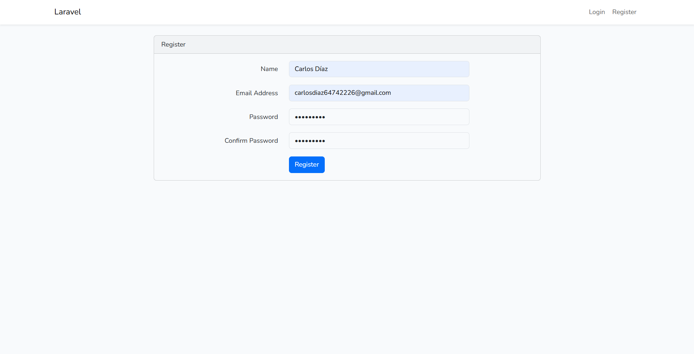
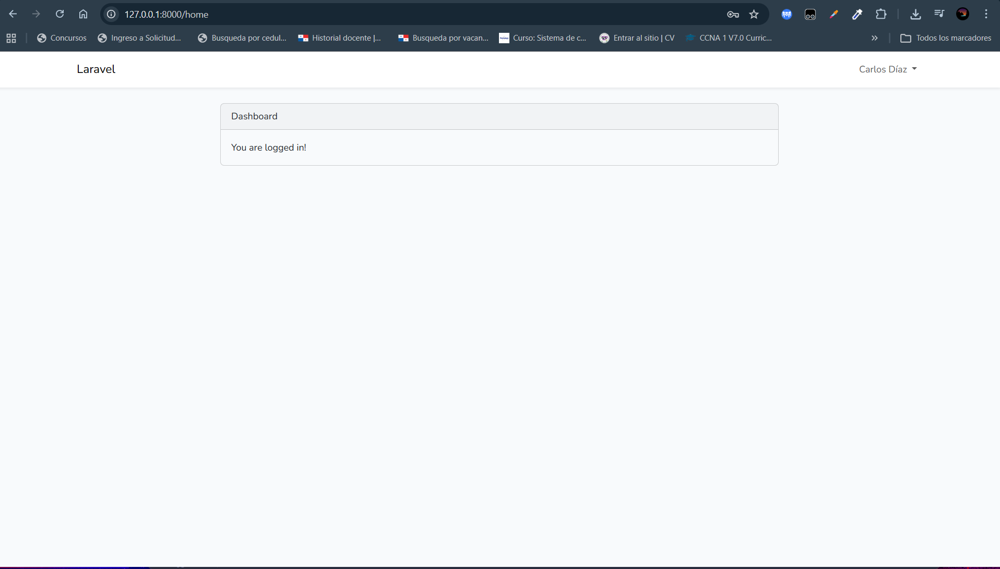

# 🧾 Laboratorio #2 - Sistema de Login en Laravel

## 📌 Introducción

En este laboratorio se desarrolló un sistema de autenticación (Login y Registro) utilizando el framework Laravel. Este proyecto permite comprender la estructura y funcionamiento del patrón Modelo-Vista-Controlador (MVC), el cual organiza la aplicación en diferentes capas para facilitar su desarrollo y mantenimiento.

Laravel implementa esta arquitectura de la siguiente forma:

* **Modelo (Model):** Representa la estructura de la base de datos (ejemplo: tabla users).
* **Vista (View):** Interfaz gráfica del usuario (formularios de login y registro).
* **Controlador (Controller):** Contiene la lógica del sistema.
* **Rutas (Routes):** Definen las URLs y conectan con los controladores.

---

## 🎯 Objetivo

* Implementar un sistema de login y registro en Laravel.
* Comprender la arquitectura MVC.
* Configurar el entorno de desarrollo.
* Ejecutar migraciones y gestionar la base de datos.

---

## ⚙️ Requisitos Previos

* PHP 8.0 o superior
* Composer
* Laravel
* WAMP (Apache y MySQL)
* MySQL o MariaDB
* Node.js y NPM
* Visual Studio Code
* Sistema Operativo: Windows

---

## 🛠️ Instalación de Herramientas

Para la ejecución del laboratorio se utilizaron las siguientes herramientas:

* **Composer:** Gestor de dependencias de PHP.
* **Laravel:** Framework de desarrollo web.
* **WAMP:** Entorno local con Apache y MySQL.

### Verificación de instalación

```bash
php -v
composer -V
```

---

## 🚀 Creación del Proyecto

```bash
laravel new labLaravelLogin
cd labLaravelLogin
```

También se puede utilizar:

```bash
composer create-project laravel/laravel labLaravelLogin
```

---

## ⚙️ Configuración del Entorno

Editar el archivo `.env`:

```env
DB_DATABASE=lablaravellogin
DB_USERNAME=root
DB_PASSWORD=
```

Luego ejecutar:

```bash
php artisan config:clear
php artisan config:cache
```

---

## 🗄️ Migraciones

```bash
php artisan migrate
```

Este comando crea las tablas necesarias en la base de datos.

---

## 🔐 Implementación de Autenticación

Se utilizó el paquete Laravel UI para generar el sistema de login:

```bash
composer require laravel/ui
php artisan ui bootstrap --auth
npm install
npm run dev
```

---

## ▶️ Ejecución del Proyecto

```bash
php artisan serve
```

Abrir en el navegador:

```
http://127.0.0.1:8000
```

---

## 🗄️ Base de Datos

* Motor: MySQL
* Base de datos: `lablaravellogin`

Tablas generadas automáticamente:

* users
* migrations
* sessions
* password_reset_tokens

📌 Respaldo incluido en:

```
database/backup.sql
```

---

## 🧠 Comandos Importantes

* `php artisan migrate`: Ejecuta migraciones
* `php artisan serve`: Inicia el servidor
* `composer install`: Instala dependencias
* `npm install`: Instala paquetes JS
* `npm run dev`: Compila archivos frontend
* `php artisan key:generate`: Genera clave de aplicación

---

## ⚠️ Dificultades y Soluciones

**Problema:** Error de conexión a MySQL
**Solución:** Configuración correcta del archivo `.env`

**Problema:** Error de clave de aplicación
**Solución:**

```bash
php artisan key:generate
```

**Problema:** Cambios en `.env` no se aplicaban
**Solución:**

```bash
php artisan config:clear
```

---

## 📸 Resultados

### Pantalla de Login


### Pantalla de Registro


### Usuario autenticado



El sistema permite registrar usuarios e iniciar sesión correctamente, validando la información en la base de datos.

---

## 📚 Referencias

* https://laravel.com/docs
* Documentación del laboratorio proporcionada por la profesora:  
  [Ver guía del laboratorio](docs/guia-lab.pdf)  
* https://www.php.net/

---

## 📅 Fecha de Ejecución

15 de abril de 2026

---

## 👨‍💻 Información del Estudiante

Este laboratorio ha sido desarrollado por:

* Nombre: Carlos Díaz
* Correo: carlos.diaz10@utp.ac.pa
* Curso: Des. de Soft. VII
* Instructor: Irina Fong

---
